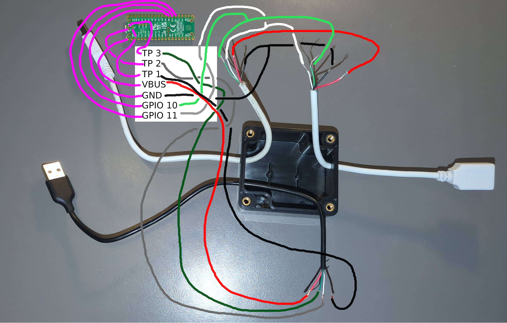
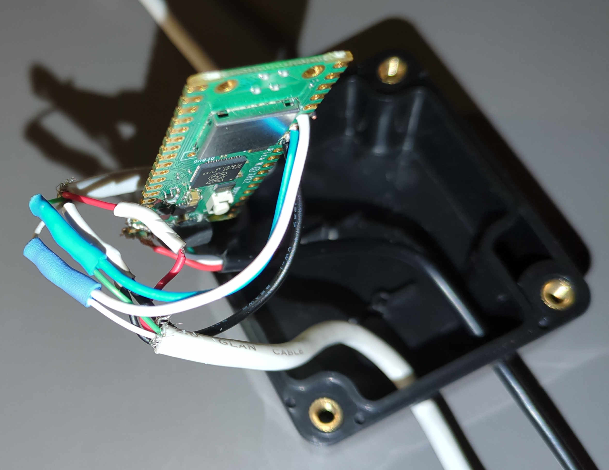
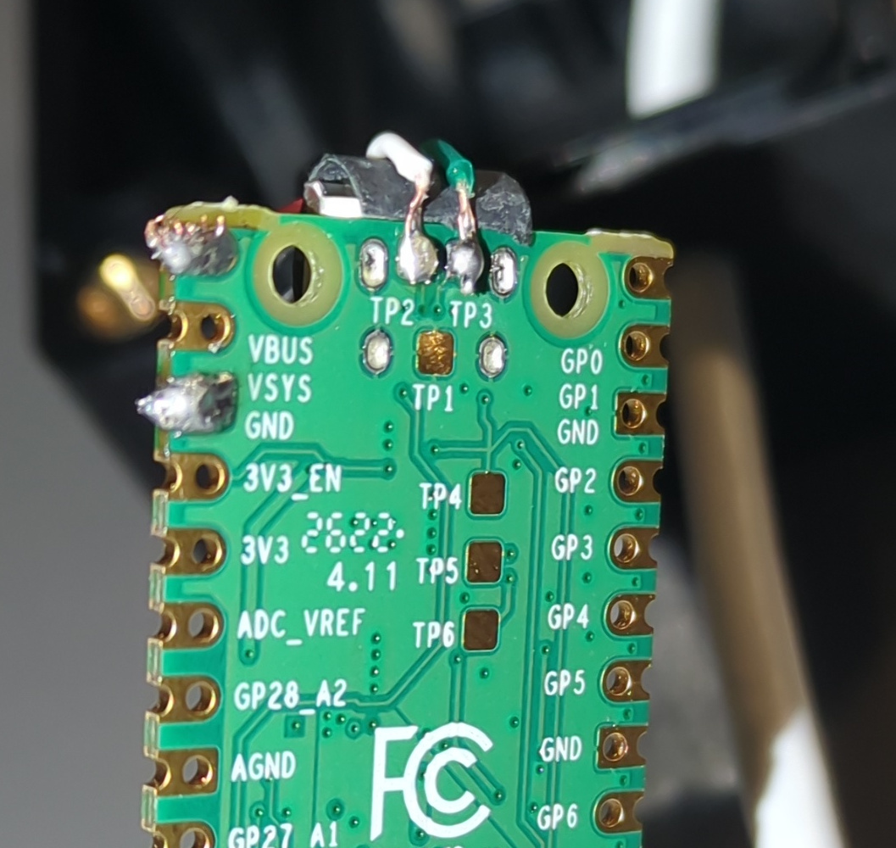
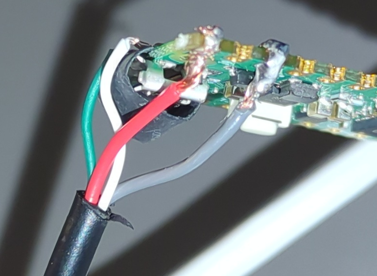
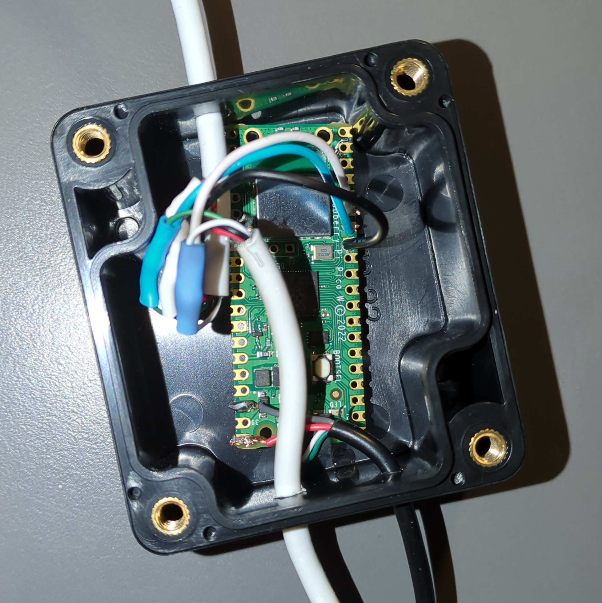

# USB Sniffer

(to decode proprietary wind signals consistently).

## Reference

The softawre / guide from [This repository](https://github.com/ataradov/usb-sniffer-lite) is used.
We require a `Raspberry Pi Pico` hat we wire as follows:

### Wiring



-   Of the Female-To-Male uSB cable that should be sniffed on
    -   green (D+) - GPIO 10
    -   white (D-) - GPIO 11
    -   black (Ground) - GND
-   Of the USB A header, we use to power/interface with the pico
    -   Easier: Connect Micro USB Side into Port...
    -   Cleaner (less space required AND can go through tiny cable hole)
        -   green - TP3
        -   white - TP2
        -   red - VBUS
        -   black - TP1 and GND (they are connected internally, so any seemed to work, too)



Directly Power and interface with the pico without micro USB header:




We get this result:



### Software and discovery of ports

The pico needs to be flashed with stock `UsbSnifferLite.uf2` from the repository.

```shell
# search for device in linux (eg ls in /dev/serial/by-id/) -> here example data from dev pico is inserted
cat /dev/serial/by-id/usb-Alex_Taradov_USB_Sniffer_Lite__RP2040__7A6B5C58-if00

# Test: connect to the virtual COM port (same path as above) - 3000000 baud
sudo apt install screen
screen /dev/serial/by-id/usb-Alex_Taradov_USB_Sniffer_Lite__RP2040__7A6B5C58-if00 3000000

# s: starts recording
# p: stops and displays recording
# exit screen mode:      Ctrl+A then K -> confirm.

# on windows you need to use putty, for me it was connected under COM4 (see device manager)
```

The correct COM port needs to be set in the software arguments (obviously).

After it worked once, there should be no need to use interactive terminals any more.
